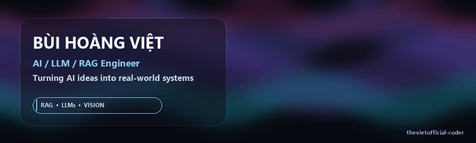
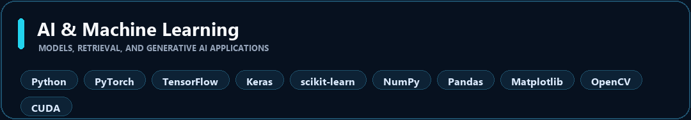
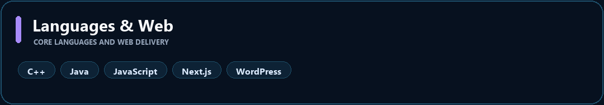
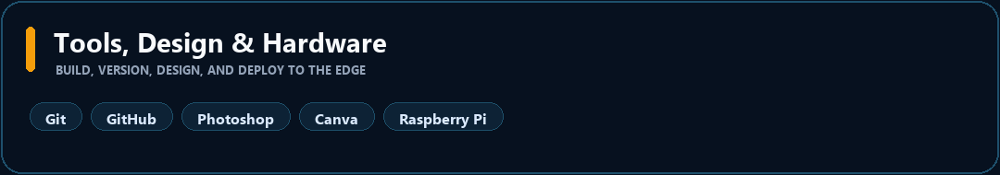

  

  
  

  

## About me

I'm **Bùi Hoàng Việt**, building practical AI applications with a focus on **LLMs, Retrieval-Augmented Generation (RAG), and Computer Vision**.

I'm currently learning **Deep Learning, NLP, LLMs, AI Agents, and MLOps**, and I care about turning AI ideas into real, working applications rather than isolated experiments.

## Now

- Working on AI applications, LLMs, RAG systems, and Computer Vision.
- Learning Deep Learning, NLP, LLMs, AI Agents, and MLOps.
- Open to collaborating on AI, Machine Learning, and Generative AI projects.

## Technical toolkit

## GitHub activity

Explore my [public repositories](https://github.com/thevietofficial-coder?tab=repositories) and [recent public activity](https://github.com/thevietofficial-coder?tab=overview).

## Resume / CV

  

## Let's connect

I'm open to internships, collaboration, and practical AI/ML/Generative AI projects.

  
  
  
  
  
  

Turning AI ideas into real-world applications.

